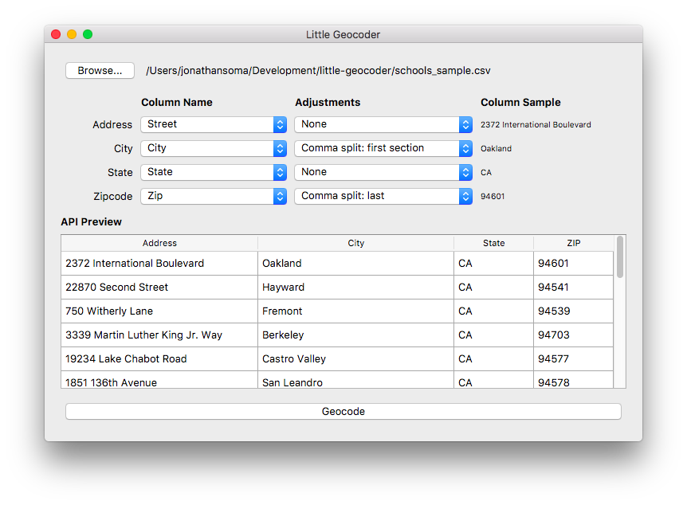

# Simple Visual Geocoder

[Download the latest release](https://github.com/jsoma/simple-visual-geocoder/releases/latest)

## Batch geocode CSV files _on your own machine_ using the Census API

Geocoding is a pain in the neck. If you're just looking at US addresses, though, Simple Visual Geocoder is here to help! **Latitude and longitude are on the way.**

Simple Visual Geocoder (SVGeocoder!) takes in CSV files and geocodes them with the [Census Bureau's Batch Geocoding service](https://www.documentcloud.org/documents/3894452-Census-Geocoding-Services-API.html) - **all without knowing Python or using the command line!**

It's more or less a very thin later on top of the LA Times' [Census Batch Geocoder](https://github.com/datadesk/python-censusbatchgeocoder), with the addition of a few simple tools to help you break out street addresses and city names.

As a fun bonus, you don't need to upload your data into 🌪 THE CLOUD 🌪.

## Using Simple Visual Geocoder

### Downloading

You can download the latest release [from GitHub](https://github.com/jsoma/simple-visual-geocoder/releases/latest) - just pick the one that's appropriate for your system.

### Simple How-To

1. Click `Browse...` to select your file
2. Pick your columns that contain address, city, state and zipcode (state and zipcode are optional)
3. Click the `Geocode` button and pick a destination for your new geocoded CSV
4. Wait and wait and wait (don't worry, it isn't frozen!)
5. A brand-new CSV file shows up, full of latitudes and longitudes!
6. 🎉🎉🎉

### How long does it take?

It's a mystery to me, but it took a little under ten minutes for the 3000-row `schools.csv` file.

### What platforms does it work on?

OS X and Windows, at the very least. It might work on Linux if you build it yourself.

## Cleaning your data with "Adjustments"

The Census Bureau requires you do split `address`, `city`, `state`, and `zipcode` into separate fields. But what if your addresses aren't all in one column and look like this?

|name|addr|
|---|---|
|Your House|540 NW Avenue, Townsville, NC|
|My House|101 Rock St, Apt 3, Guitar City, NV|

Oh no! Do we need to split it apart? Do we need to fight against that `Apt 3C`? No! No! We're too lazy for that!

SVGeocoder has built-in data cleaning tools called **Adjustments** to make splitting long addresses up easy. You just pick an adjustment from a dropdown and it'll clip out the part you're interested in.

||540 NW Ave, Townsville, NC|101 Rock St, Apt 3, Guitar City, NV |Use as|
|---|---|---|---|
|**Comma split: first section**|540 NW Ave|101 Rock St|`address`|
|**Comma split: second**|Townsville|Apt 3|-|
|**Comma split: third**|NC|Guitar City|-|
|**Comma split: second-to-last**|Townsville|Guitar City|`city`|
|**Comma split: last**|NC|NV|`state`|

See, it's easy to pick out the parts you're interested in! You can also split on newlines/linebreaks if you want.

Have another kind of adjustment you'd like to see? [Create an issue](https://github.com/jsoma/simple-visual-geocoder/issues/new) and I'll take a peek.

## Troubleshooting

### Help! I can't open it on OS X because my computer is scared of it!

Try to right-click (control+click) and select **Open**.

You can also go into `System Preferences > Security & Privacy` and change **Allow apps downloaded from:** to be `App Store and identified developers`. You might need to click the lock on the bottom-left corner of the window before it'll let you change anything.

### Help! I told it to geocode and it froze up!

It didn't freeze, it's just busy geocoding for you! It should finish eventually. Just be patient. It takes me about 10 minutes to run 3000.

_At some point it would be nice to implement threads so that this doesn't happen._

### Help! I'm building this app on my own and it's HUGE!

Anaconda on Windows installs versions of numpy & friends that include something called MKL. MKL is big. Anaconda doesn't play nice with `venv` so the only way I could figure out to get around it was to just uninstall Anaconda and install everything from Python.org instead.	

## Attribution

Icon made by [Smashicons](https://www.flaticon.com/authors/smashicons) from [www.flaticon.com](https://www.flaticon.com/) and is licensed by [CC 3.0 BY](http://creativecommons.org/licenses/by/3.0/)
